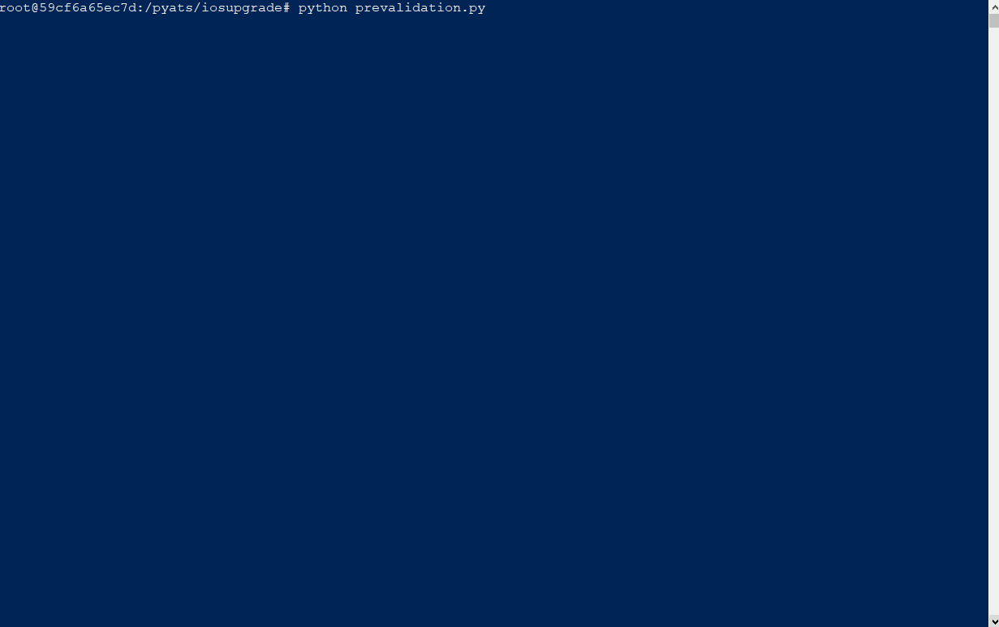

# iosupgrade
iosupgrade is a work in progress. It features a collection of python scripts to help automate the image transfer and software upgrade process for IOS routers including the pre and post validation steps.
The collection uses Nornir, Napalm and Genie libraries.

#### prevalidation.py
    Prevalidate storage requirements and store baselines for running config and operational states prior
    to OS Staging and Upgrade
    
    
    
#### iosstaging.py
    Transfer/Stage IOS image for router upgrade and validate MD5. Bootvars not changed.
    
#### iosupgrade.py
    Update bootvars and perform IOS upgrade with reload.
    
#### postvalidation.py
    Post Upgrade validation - Collect and store current running config and operational states then compare diffs with earlier collection.
  

#### TODO:
- Refactor four scripts into single command line tool with argument for various stages and options.
- Add color formatting to output.
- Add logfile along with output for each run
- Add default enforcement for order of execution, with ability to bypass (i.e: prevalidation before upgrade)
- args for verbose modes during execution
